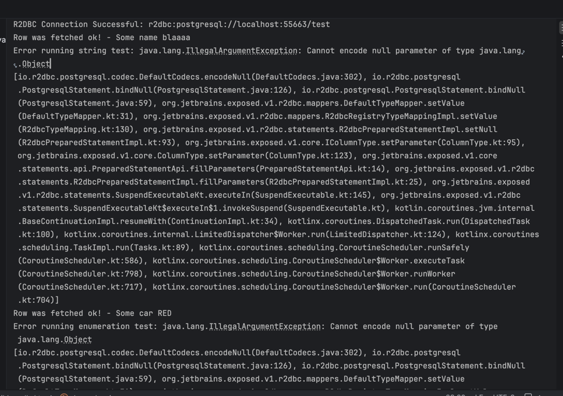
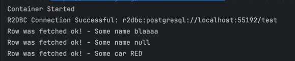

# Exposed R2DBC - nullable text / varchar / enumerationByName binding can fail depending on the database / driver

This demo serves as a testing ground to catch a potential issue with nullable strings or enumerations when using Exposed with R2DBC and PostgreSQL (or potentially other dbs). The issue manifests as a failure to bind nullable values correctly, leading to unexpected behavior or errors in the application.

This repo creates a "test" on the main root that starts a testcontainer, migrates a two tables to use as sample, and tries to both insert non-null values (to assert that the db is working), and then to insert null values into nullable columns (which trigger the exceptions in this test) 

This app can be executed with the following command. Needs a docker daemon running:

```shell
./gradlew run
```

### Issue

`exposed-r2dbc`'s `PrimitiveTypeMapper` lists `StringColumnType` in its `columnTypes` but does not handle the null case for it — the `when` in `setValue` has no `is StringColumnType` arm. The binding therefore falls through to `DefaultTypeMapper`, which on PostgreSQL calls `statement.bindNull(index, Object::class.java)`. `r2dbc-postgresql`'s `DefaultCodecs.encodeNull` rejects `Object` and throws.



I've tested my changes using a locally published version of exposed, and the string tests succeed:



`EnumerationNameColumnType` has the same issue, but I'm not certain it would be best to treat this as a "Primitive Type". My fix for the primitive type mapper does not cover this enumeration type yet;

### Stack trace sample
```
io.r2dbc.postgresql.codec.DefaultCodecs.encodeNull(DefaultCodecs.java:302)
io.r2dbc.postgresql.PostgresqlStatement.bindNull(PostgresqlStatement.java:126)
io.r2dbc.postgresql.PostgresqlStatement.bindNull(PostgresqlStatement.java:59)
org.jetbrains.exposed.v1.r2dbc.mappers.DefaultTypeMapper.setValue(DefaultTypeMapper.kt:31)
org.jetbrains.exposed.v1.r2dbc.mappers.R2dbcRegistryTypeMappingImpl.setValue(R2dbcTypeMapping.kt:119)
org.jetbrains.exposed.v1.r2dbc.statements.R2dbcPreparedStatementImpl.setNull(R2dbcPreparedStatementImpl.kt:93)
...
Caused by: java.lang.IllegalArgumentException: Cannot encode null parameter of type java.lang.Object
```

### Observations

This issue already does not exist in the latest 1.1.1.RELEASE of the Postgres-R2DBC Driver. It seems there was a defensive change when handling null object types; However, it seems also reasonable to tackle the issue in the Exposed library as well, to ensure that nullable values are handled consistently across different database drivers and platforms.